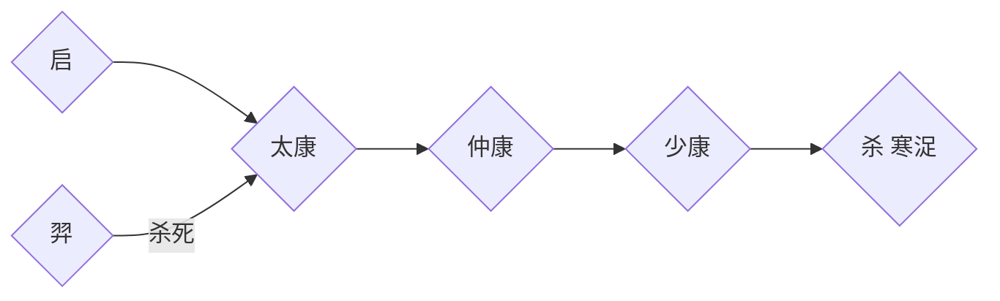

## 简史
盘古 女娲 共工  
有巢氏、燧人氏、伏羲氏（结网、打猎、饲养）、神农氏（药材、耕种）  
炎帝、皇帝（姬轩辕、有熊部落）.蚩尤（九黎部落）→后南迁为苗人  
尧、舜、禹→启  
桀（妹喜）  
400年后  

- 夏

- 商  汤→伊尹→→→→→→→→→→纣王
- 周  文王、武王 成王→康王（周公旦摄政）    成康之治
 厉王                                                周召共和
周幽王
- 春秋

>春秋五霸：  
齐桓公（鲍叔牙、管仲）  
晋文公、重耳  
秦穆公    霸西戎  
楚庄王    楚昭王杀伍子胥全家  
宋襄公  

楚兴：南方地广人稀、土地肥沃。  
齐宋、晋楚争霸，郑国子产，鲁(文化中心，弱国，制于齐)  
孔子、鲁班、公输般  
战国七雄：韩赵魏三家分晋，秦齐楚燕  

>魏国攻打赵国（齐国）  围魏救赵，桂陵之战  
韩魏攻打齐  
魏国攻打韩国（齐国）  退兵减灶，马陵之战  

- 秦国  
秦穆公→秦孝公   商鞅变法  
孝公卫鞅变法：民以十家或五家为一组。齐人隆技击，得一首赐锱金，事小敌脆则偷，事大敌坚则涣，亡国之兵也；魏……（体能测试，通过则永免赋税），税寡，危国之兵也。秦，生民也狭厄，使民也酷烈。厄而用之，得而功之，功赏相长也。  
楚怀王被张仪骗，与齐断交，被魏攻打  
齐灭宋，六国伐齐，燕昭王任乐毅伐齐  
长平之战，魏公子信陵君窃符救赵  

秦国贡献：
1. 确立“三公九卿”和“郡县制”
    - 三公：太尉（军事），丞相（行政），御史大夫（纪检）
    - “三公九卿”一直到隋朝被“三省六部”替代
    - “郡县制”：任命官员到地方上，不可世袭
2. 统一度量衡、文字、货币  
    - 书同文
    - 车同轨，修建“高速公路”，骨子里统一中国
3. 南征百越，北伐匈奴
    - 把秦、赵、燕长城连起来
4. 焚书坑儒

### 秦汉
- 楚汉相争  
西汉    汉高祖刘邦，汉惠帝（萧规、曹随，黄老之术）文景之治
- 七国之乱（周亚夫平定）  
汉武帝（刘彻）罢黜百家、独尊儒术。卫青、霍去病破匈奴，盐铁论  
汉昭帝    无为政治  
王莽  
刘秀  
- 三国  
司马懿→司马昭→司马炎  
- 隋    杨坚、杨广、杨素  
- 唐    李渊、李元吉、李世民  玄武门之变（尉迟、敬德）    贞观之治  
三省六部    武则天  

## 故事
### 宣武门之变的后续影响。  

李世民杀掉长子，自己做皇帝，带来篡位的风气。  
李世民的太子、四子模仿下，也使用暗杀手段。所以把皇位传给了最老实的李治。  
李治的软弱结果是武则天当政的关键。  

武则天当皇帝需要做的事
1. 争取人才：建立科举制，以提拔同样没有后台的人才。借此对抗李渊体系的关陇集团的人才体系。
2. 找到一个能放到明面上的思想。儒教不行，因为武则天是女人，又要篡位。道教不行，李氏已经占了这个IP。最终的选择是佛教。
3. 强化内里的法家思想。使用酷吏。
4. 采用告密制度。告密制度的结果是全社会都经不起考验，整个社会最基本的人际关系都被破坏掉，变成一个《大逃杀》游戏。

### 李隆基把府兵制改为募兵制
府兵制是指定一批人为军户，不用纳税。不用政府养，但战斗力差。  
府兵制终结的原因：
1. 用兵太多
2. 土地集中，导致兵户分配不到太多土地。

结果：很多府兵变成土匪。  

解决：改为募兵制度。提高了战斗力，但容易造成军阀割据。安史之乱。  

安史之乱后为何唐朝衰落
- 节度使（军阀）战乱
- 吐蕃连续入侵
- 宦官专政（宦官原本是为了制约节度使）

### 宋朝
赵匡胤陈桥兵变，黄袍加身。  

总结前朝教训
- 唐朝地方军权太大
- 唐朝宦官专政（有替皇帝批改文件和传递文件的权力，有禁军的兵权）
- 五代十国军人政变。

三个教训总结为一条：军权过于集中，解决方案：
- 保证禁军的数量、质量
- 将领轮岗。“兵不知将，将不知兵”
- 缩小宰相的权力，划分为三个部门
- 重文轻武
- 不允许宦官学习文化
- 限制皇帝的权力

### 明末
- 党派斗争，使得政治正确压倒一切。求和、防守都被认为是政治不正确。
- 小冰期
- 实物税赋质量不一，经办人有很大的腐败空间。张居正“一条鞭法”，把实物税和徭役合并为银两。问题是，东北战乱，向东北拨军费是银两，东北屯田减少，商人也不愿意运粮过去。导致东北银多粮少，内地税收负担也很重。
- 全球白银危机。明朝时，美洲发现银矿，明末银矿产量开始下降，欧洲恰好出现经济危机，对华贸易骤减。日本闭关锁国，这个白银来源也断了。

### 清军入关
一个很聪明的招：为崇祯帝复仇

#### 辫子问题
凡是在特别强调团结的集体里，都会有羞辱新人的现象。  
羞辱新人的意义就在于，每一个人在加入集体之前，他都是拥有独立人格的自由人。这种状态下的人是不能真正服从集体的。羞辱新人，是为了先摧毁他的自尊，让他认识到自己的尊严、人格一文不值。等到这个人的自我认同全都崩溃了，再让他经历和队友同吃同住、同享受同患难的集体生活。让他重新建立完全依赖于集体的人格，变成一个集体观念极强，能完全服从集体的人。

实行剃发令，第一是把那些拒绝迎合政府的顽固知识分子挑出来，把他们肉体消灭。第二是要让那些嘴上说投降心里面却瞧不起满清的知识分子遭受一次肉体和精神上的双重羞辱  
这剃发，就相当于是知识分子降清的投名状。
#### 皇权问题
宋、明、清的皇权依次增强。  
但是大权独揽是有风险的，如果皇帝昏庸，或者懒得管理操作，会出现大臣专权、宦官专权、外戚专权。  

清朝解决方式：
1. 实行严酷的皇家教育制度。
2. 择优继承。  
    为了防止继承问题的强烈冲突，有设计了“秘密立储制度”  
  - 太子本人不知道被选中了，所以不会骄傲自大，不会谋杀现任皇帝。群臣也没有动力过早攀附
  - 老皇帝可以随时撤换接班人，不会引起大的震荡
  - 所有可能的继承人都老老实实的
  - 缺点是，胜出者大多拘谨、保守。恰逢世界多变。
